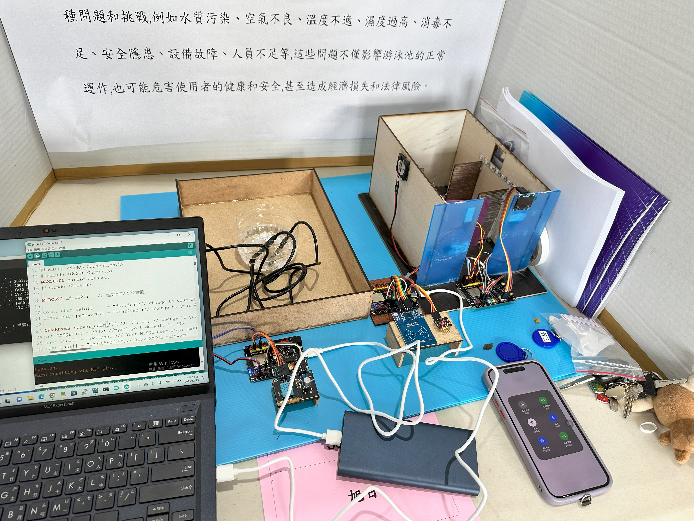

泳池管理系統
====
本專題使用三塊 Linklt 7697 開發版運行，分別檢測泳者心律血氧偵測、泳池水溫水質監測、更衣間安全警報，結合 MySQL 蒐集資料並繪製圖表



各程式功能介紹
----

```people.ino```

* RFID 模組：透過 MFRC522 讀取 RFID 卡的 UID，並連接 MySQL 資料庫，將卡片的 UID、心跳數值和血氧數值存儲到資料庫

* 心率感測：使用 MAX30105 感測模組來檢測心跳。程式碼中使用了心跳陣列和低通濾波器，並計算出平均心跳率

* 血氧感測：使用 MAX30105 感測模組來檢測血氧。程式碼中計算了血氧飽和度（SpO2），並使用低通濾波器進行平滑處理

* OLED顯示：使用 Adafruit SSD1306 和 Adafruit GFX 庫來控制 OLED 顯示屏，顯示心跳數值和血氧數值的圖示

* WiFi：連接到 WiFi 網路，使用提供的 SSID 和密碼

* MySQL 資料庫：連接到 MySQL 資料庫，將 RFID卡 片的 UID、心跳數值和血氧數值插入到資料庫中

```pool_enviroment.ino```

連接 Wi-Fi 和 MySQL 伺服器：
* 使用 WiFi.h 庫連接 Wi-Fi 網路
* 使用 MySQL_Connection.h 和 MySQL_Cursor.h 庫連接到 MySQL 伺服器

感測器資料收集：
* 使用 DHT11 感測器讀取溫度和濕度
* 使用 DallasTemperature 庫讀取 DS18B20 溫度感測器的溫度
* 使用 TDS（Total Dissolved Solids）水質感測器讀取水中的溶解固體總量
* 使用 MQ-2 氣體感測器讀取空氣中的揮發性有機化合物（VOC）

數據存儲到MySQL：
* 將感測到的溫度、濕度、水溫、水質和空氣品質數據存儲到MySQL資料庫中

顯示及調整數據：
* 將空氣中的揮發性有機化合物（VOC）數據顯示在 Serial Monitor 中
* 透過 TDS 感測器測量的水質數據也會顯示在 Serial Monitor 中
* 使用中位數濾波法來穩定 TDS 感測器的數據

`Toilet.ino`

連接 Wi-Fi：
* 使用 ESP32 的 WiFi.h 庫連接 Wi-Fi 網路，使用提供的 SSID 和密碼

連接LINE Notify：
* 定義 LINE Notify 的權杖（Token），用於將訊息發送到 LINE

設定時間：
* 使用 NTP（Network Time Protocol）從網路獲取時間，設定了GMT時區和夏令時偏移
  
感測器資料收集：
* 使用 DHT11 感測器讀取溫度和濕度
* 讀取光敏電阻感測器的數值，控制一個更衣室燈光開關
* 使用觸摸感測器判斷房間的使用狀態

顯示資訊：
* 在 OLED 顯示屏上顯示即時的溫度和濕度
* 顯示更衣室的光照狀態
* 顯示更衣室使用狀態（是否有人）

安全警報：
* 使用有源蜂鳴器作為警報器，當觸摸感測器檢測到危險狀況時，觸發蜂鳴器並使用LINE Notify API發送警報通知

MySQL資料庫繪製圖表
----
使用 plots 資料中三個 python 程式針對 MySQL 資料繪製圖表
